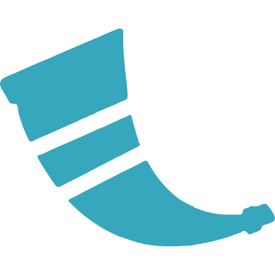

# Unikraft Applications & Examples Catalog

This repository contains the official catalog of supported applications by
Unikraft.

In addition to supported applications, this repository contains templates and
examples of user-level programs built on top of runtimes that are available in
the catalog.

To get started using these pre-built Unikraft unikernel images, start by [installing the companion command-line toolchain `kraft`](https://unikraft.org/docs/cli):

```
curl --proto '=https' --tlsv1.2 -sSf https://get.kraftkit.sh | sh
```

You can view all the up-to-date images which are built from this repository directly in the CLI by running:

```
kraft pkg ls --apps --update
```

## Examples

| | Example |
|-|:-|
|  | [Simple Caddy Web Server](https://github.com/unikraft/catalog/tree/main/examples/caddy) |
|  | [DuckDB integration in Go](https://github.com/unikraft/catalog/tree/main/examples/duckdb-go) |
|  | <ul><li>[Simple "Hello, world!" application written in C](https://github.com/unikraft/catalog/tree/main/examples/helloworld-c)</li><li>[Simple C HTTP Web Server with `sys/socket.h`](https://github.com/unikraft/catalog/tree/main/examples/http-c)</li></ul> |
|  | <ul><li>[Simple "Hello, world!" application written in C++](https://github.com/unikraft/catalog/tree/main/examples/helloworld-cpp)</li><li>[Simple C++ HTTP Web Server with `sys/socket.h`](https://github.com/unikraft/catalog/tree/main/examples/http-cpp)</li><li>[Simple C++ HTTP Web Server with `boost`](https://github.com/unikraft/catalog/tree/main/examples/http-cpp-boost)</li></ul> |
|  | [Simple Go 1.21 HTTP Web Server with `net/http`](https://github.com/unikraft/catalog/tree/main/examples/http-go1.21) |
|  | <ul><li>[Simple "Hello, world!" application written in Rust built via `cargo`](https://github.com/unikraft/catalog/tree/main/native/helloworld-rs)</li><li>[Rust Actix Web Server](https://github.com/unikraft/catalog/tree/main/examples/http-rust1.75-actix-web4)</li><li>[Rust/Rocket v0.5](https://github.com/unikraft/catalog/tree/main/examples/http-rust1.75-rocket0.5)</li><li>[Rust/Tokio Server](https://github.com/unikraft/catalog/tree/main/examples/http-rust1.75-tokio)</li><li>[Rust HTTP Web Server](https://github.com/unikraft/catalog/tree/main/examples/http-rust1.75)</li></ul> |
|  | <ul><li>[Simple NodeJS 18 HTTP Web Server with `http`](https://github.com/unikraft/catalog/tree/main/examples/http-node18)</li><li>[Simple NodeJS 21 HTTP Web Server with `http`](https://github.com/unikraft/catalog/tree/main/examples/http-node21)</li><li>[Web server with NodeJS 18, Prisma and ExpressJS](https://github.com/unikraft/catalog/tree/main/examples/node18-prisma-rest-express)</li><li>[Web Server with NodeJS 21 and ExpressJS](https://github.com/unikraft/catalog/tree/main/examples/node21-expressjs)</li><li>[Web Server with NodeJS 21 Prisma and ExpressJS](https://github.com/unikraft/catalog/tree/main/examples/node21-prisma-rest-express)</li></ul> |
|  | [Simple Perl HTTP Web Server](https://github.com/unikraft/catalog/tree/main/examples/http-perl5.38) |
|  | [Simple PHP HTTP Web Server](https://github.com/unikraft/catalog/tree/main/examples/http-php8.2) |
|  |<ul><li>[Simple Flask 3.0 HTTP Web Server using Python 3.10](https://github.com/unikraft/catalog/tree/main/examples/http-python3.10-flask3.0)</li><li>[Simple Flask 3.0 HTTP Web Server using Python 3.12](https://github.com/unikraft/catalog/tree/main/examples/http-python3.12-flask3.0)</li></ul> |
|  | <ul><li>[Simple Python 3.10 HTTP Web Server with `http.server.HTTPServer`](https://github.com/unikraft/catalog/tree/main/examples/http-python3.10)</li><li>[Simple Python 3.12 HTTP Web Server with Flask and SQLite](https://github.com/unikraft/catalog/tree/main/examples/python3.12-flask3.0-sqlite)</li></ul> |
|  | [Simple Ruby HTTP Web Server](https://github.com/unikraft/catalog/tree/main/examples/http-ruby3.2) |
|  | [Simple Gohugo Web Server](https://github.com/unikraft/catalog/tree/main/examples/hugo) |
|  | [Caching with Memchached](https://github.com/unikraft/catalog/tree/main/examples/memcached) |
|  | [Data management and caching with Redis](https://github.com/unikraft/catalog/tree/main/examples/redis) |
|  | [HTTP routing and reverse proxy with Skipper](https://github.com/unikraft/catalog/tree/main/examples/skipper) |

## Library

| Status | Image |
|-|-|
| [](https://github.com/unikraft/catalog/actions/workflows/library-base.yaml) | [`unikraft.org/base:latest`](library/base) |
| [](https://github.com/unikraft/catalog/actions/workflows/library-caddy2.7.yaml) | [`unikraft.org/caddy:2.7`](library/caddy/2.7) |
| [](https://github.com/unikraft/catalog/actions/workflows/library-helloworld.yaml) | [`unikraft.org/helloworld:latest`](library/helloworld) |
| [](https://github.com/unikraft/catalog/actions/workflows/library-hugo0.122.yaml) | [`unikraft.org/hugo:0.122`](library/hugo/0.122) |
| [](https://github.com/unikraft/catalog/actions/workflows/library-lua5.4.4.yaml) | [`unikraft.org/lua:5.4.4`](library/lua/5.4.4) |
| [](https://github.com/unikraft/catalog/actions/workflows/library-lua5.4.yaml) | [`unikraft.org/lua:5.4`](library/lua/5.4) |
| [](https://github.com/unikraft/catalog/actions/workflows/library-memcached1.6.yaml) | [`unikraft.org/memcached:1.6`](library/memcached/1.6) |
| [](https://github.com/unikraft/catalog/actions/workflows/library-nginx1.15.yaml) | [`unikraft.org/nginx:1.15`](library/nginx/1.15) |
| [](https://github.com/unikraft/catalog/actions/workflows/library-nginx1.25.yaml) | [`unikraft.org/nginx:1.25`](library/nginx/1.25) |
| [](https://github.com/unikraft/catalog/actions/workflows/library-node18.yaml) | [`unikraft.org/node:18`](library/node/18) |
| [](https://github.com/unikraft/catalog/actions/workflows/library-node20.yaml) | [`unikraft.org/node:20`](library/node/20) |
| [](https://github.com/unikraft/catalog/actions/workflows/library-node21.yaml) | [`unikraft.org/node:21`](library/node/21) |
| [](https://github.com/unikraft/catalog/actions/workflows/library-perl5.38.yaml) | [`unikraft.org/perl:5.38`](library/perl/5.38) |
| [](https://github.com/unikraft/catalog/actions/workflows/library-php8.2.yaml) | [`unikraft.org/php:8.2`](library/php/8.2) |
| [](https://github.com/unikraft/catalog/actions/workflows/library-python3.10.yaml) | [`unikraft.org/python:3.10`](library/python/3.10) |
| [](https://github.com/unikraft/catalog/actions/workflows/library-python3.12.yaml) | [`unikraft.org/python:3.12`](library/python/3.12) |
| [](https://github.com/unikraft/catalog/actions/workflows/library-redis7.0.yaml) | [`unikraft.org/redis:7.0`](library/redis/7.0) |
| [](https://github.com/unikraft/catalog/actions/workflows/library-redis7.2.yaml) | [`unikraft.org/redis:7.2`](library/redis/7.2) |
| [](https://github.com/unikraft/catalog/actions/workflows/library-ruby3.2.yaml) | [`unikraft.org/ruby:3.2`](library/ruby/3.2) |
| [](https://github.com/unikraft/catalog/actions/workflows/library-skipper0.18.yaml) | [`unikraft.org/skipper:0.18`](library/skipper/0.18) |
